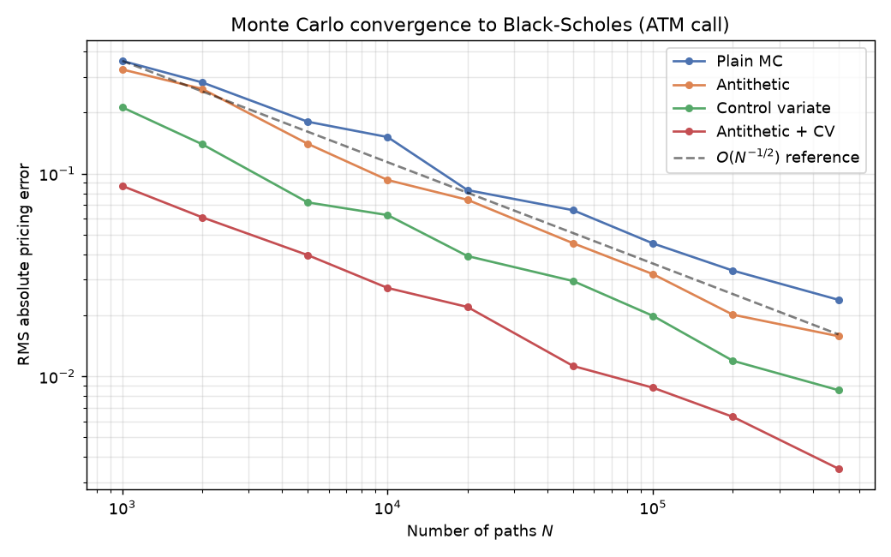
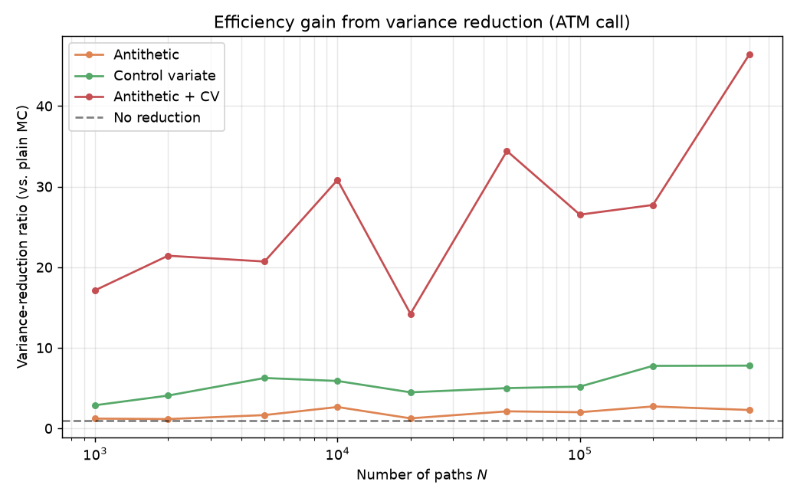

# mc_pricing: Monte Carlo Option Pricing Engine

[](https://github.com/aksbhaskar/mc_pricing/actions/workflows/ci.yml)
[](https://www.python.org/)
[](LICENSE)
[](#)

A compact, well-tested quantitative library for pricing **vanilla European
options** under the **Black–Scholes–Merton** model by Monte Carlo simulation,
with the closed-form solution used as ground truth, two variance-reduction
techniques, confidence intervals on every estimate, Monte Carlo Greeks, and an
implied-volatility solver.

The design goal was not "a Monte Carlo tutorial" but a small piece of
production-shaped quant code: a layered package, math-first docstrings, and a
test suite that pins the simulation to the analytical model within its own
error bars.

---

## Highlights

- **Analytical Black–Scholes–Merton** pricing and all five Greeks (Delta, Gamma,
  Vega, Theta, Rho), with continuous dividend yield, the validation baseline.
- **Exact GBM terminal sampling**: no path discretisation for European
  payoffs, so the estimator is *bias-free* (no time-stepping error), only
  Monte Carlo noise.
- **Variance reduction**: antithetic variates and a terminal-price control
  variate, combining for a **>20× variance-reduction ratio** on an ATM call.
- **Confidence intervals** (CLT standard error) reported on *every* Monte Carlo
  number, prices and Greeks alike.
- **Monte Carlo Greeks**: unbiased **pathwise** estimators for Delta and Vega;
  **common-random-number finite differences** for Gamma, Theta, and Rho.
- **Implied volatility** via Brent's method with no-arbitrage guards.
- **127 tests**, a convergence/timing benchmark suite with plots, and CI across
  Linux/macOS/Windows and Python 3.10–3.12.

---

## The mathematical model

### Geometric Brownian motion & risk-neutral pricing

The underlying $S_t$ is assumed to follow a geometric Brownian motion. Under the
**risk-neutral measure** $\mathbb{Q}$ its drift is the cost of carry $r - q$
(risk-free rate minus dividend yield):

$$
dS_t = (r - q)\,S_t\,dt + \sigma\,S_t\,dW_t.
$$

By Itô's lemma this SDE has the exact solution

$$
S_T = S_0 \exp\!\Big[\big(r - q - \tfrac12\sigma^2\big)T + \sigma\sqrt{T}\,Z\Big],
\qquad Z \sim \mathcal{N}(0,1),
$$

so $S_T$ is **log-normal**. The fundamental theorem of asset pricing says the
fair value today is the discounted risk-neutral expectation of the payoff:

$$
V = e^{-rT}\,\mathbb{E}^{\mathbb{Q}}\!\big[\,\text{payoff}(S_T)\,\big],
\qquad
\text{payoff}(S_T) = \max\!\big(\omega (S_T - K),\, 0\big),
$$

where $\omega = +1$ for a call and $\omega = -1$ for a put.

### The Black–Scholes–Merton formula

Because $S_T$ is log-normal, that expectation has a closed form. With

$$
d_1 = \frac{\ln(S_0/K) + (r - q + \tfrac12\sigma^2)T}{\sigma\sqrt{T}},
\qquad
d_2 = d_1 - \sigma\sqrt{T},
$$

the call and put prices are

$$
C = S_0 e^{-qT} N(d_1) - K e^{-rT} N(d_2),
\qquad
P = K e^{-rT} N(-d_2) - S_0 e^{-qT} N(-d_1),
$$

which the package evaluates in a single unified expression
$V = \omega\big[S_0 e^{-qT} N(\omega d_1) - K e^{-rT} N(\omega d_2)\big]$.
These two legs satisfy **put–call parity**,

$$
C - P = S_0 e^{-qT} - K e^{-rT},
$$

which the test suite checks independently.

---

## Monte Carlo methodology

For a European payoff the value depends **only on the terminal price** $S_T$,
never on the path in between. We therefore sample $S_T$ *exactly* from its
log-normal law rather than discretising the SDE. This eliminates
time-stepping bias entirely, leaving only statistical error. The estimator is

$$
\hat{V} = \frac{1}{N}\sum_{i=1}^{N} e^{-rT}\,\text{payoff}\big(S_T^{(i)}\big),
\qquad
S_T^{(i)} = S_0 \exp\!\Big[\big(r - q - \tfrac12\sigma^2\big)T + \sigma\sqrt{T}\,Z_i\Big].
$$

By the **Central Limit Theorem** the estimator is asymptotically normal, so we
report the standard error and a $(1-\alpha)$ confidence interval

$$
\mathrm{SE} = \frac{s}{\sqrt{N}},
\qquad
\hat{V} \pm z_{1-\alpha/2}\,\mathrm{SE},
$$

with $s$ the sample standard deviation of the discounted payoffs. Error decays
as $O(N^{-1/2})$, the characteristic slow Monte Carlo convergence that
variance reduction attacks.

---

## Variance reduction

Both techniques leave the estimator **unbiased** while shrinking its variance,
so the confidence interval tightens for the same number of paths (equivalently,
fewer paths are needed to hit a target accuracy).

### Antithetic variates

For each draw $Z$ we also use its mirror $-Z$ and average the paired payoffs.
Since the payoff is a monotone function of $Z$, the pair is negatively
correlated, and

$$
\text{Var}\!\Big[\tfrac12\big(Y(Z) + Y(-Z)\big)\Big]
= \tfrac12\text{Var}[Y]\,(1 + \rho) \le \tfrac12\text{Var}[Y],
\qquad \rho = \text{Corr}\big(Y(Z), Y(-Z)\big) < 0.
$$

### Control variates

We exploit a correlated quantity with a **known** expectation. The terminal
price $S_T$ is the natural control because its risk-neutral mean is exactly

$$
\mathbb{E}[S_T] = S_0 e^{(r-q)T}.
$$

Given discounted payoffs $Y$ and controls $X = S_T$, the controlled estimator

$$
Y^\star_i = Y_i - b\,(X_i - \mathbb{E}[X])
$$

is unbiased for any $b$, and the variance-minimising coefficient is

$$
b^\star = \frac{\text{Cov}(Y, X)}{\text{Var}(X)},
\qquad
\text{Var}[Y^\star] = \text{Var}[Y]\,\big(1 - \rho_{YX}^2\big).
$$

The two techniques compose, and together deliver the largest gains (see the
benchmark below).

---

## Greeks

The library computes each Greek both in closed form (from Black–Scholes) and by
Monte Carlo, choosing the MC estimator best suited to each sensitivity.

| Greek | Meaning | Closed form | Monte Carlo estimator |
|-------|---------|-------------|-----------------------|
| **Delta** $\partial V/\partial S$ | spot sensitivity | $e^{-qT}N(\omega d_1)\cdot\omega$ | **pathwise** |
| **Gamma** $\partial^2 V/\partial S^2$ | delta convexity | $e^{-qT}\phi(d_1)/(S\sigma\sqrt T)$ | finite diff. (CRN) |
| **Vega** $\partial V/\partial\sigma$ | vol sensitivity | $S e^{-qT}\phi(d_1)\sqrt T$ | **pathwise** |
| **Theta** $-\partial V/\partial T$ | time decay | (see docstring) | finite diff. (CRN) |
| **Rho** $\partial V/\partial r$ | rate sensitivity | $\omega K T e^{-rT}N(\omega d_2)$ | finite diff. (CRN) |

**Pathwise estimators (Delta, Vega).** When the discounted payoff is
differentiable almost everywhere in the parameter, we differentiate *inside* the
expectation and estimate the derivative on each path. Using
$\partial S_T/\partial S_0 = S_T/S_0$ and
$\partial S_T/\partial\sigma = S_T(\sqrt{T}\,Z - \sigma T)$:

$$
\Delta = e^{-rT}\,\mathbb{E}\!\left[\omega\,\frac{S_T}{S_0}\,\mathbf{1}\{\omega(S_T-K)>0\}\right],
\qquad
\mathcal{V} = e^{-rT}\,\mathbb{E}\!\left[\omega\,S_T(\sqrt{T}\,Z - \sigma T)\,\mathbf{1}\{\omega(S_T-K)>0\}\right].
$$

These are unbiased and much lower-variance than bumping, with no step-size to
tune.

**Finite differences with common random numbers (Gamma, Theta, Rho).** Gamma is
a *second* derivative (the pathwise first derivative is a non-differentiable
indicator), and Theta/Rho are conventionally re-priced. We bump-and-reprice
using the **same** normals for the bumped and base valuations, so the random
part cancels in the difference, turning an $O(h^{-2})$-variance estimator into
an $O(1)$ one. Central differences give $O(h^2)$ bias:

$$
\Gamma \approx \frac{V(S_0+h) - 2V(S_0) + V(S_0-h)}{h^2},
\qquad
\Theta \approx -\frac{V(T+h_T) - V(T-h_T)}{2h_T},
\qquad
\rho \approx \frac{V(r+h_r) - V(r-h_r)}{2h_r}.
$$

---

## Benchmark results

Produced by [`benchmarks/run_benchmarks.py`](benchmarks/run_benchmarks.py) on an
ATM 1-year call ($S_0=K=100$, $r=5\%$, $q=2\%$, $\sigma=20\%$).

### Convergence

RMS pricing error vs. path count, averaged over 40 independent seeds. Every
method tracks the theoretical $O(N^{-1/2})$ slope; variance reduction shifts the
whole curve **down**: the combined estimator (red) reaches at 10k paths an
accuracy plain MC needs ~200k paths for.



### Variance-reduction ratio & timing

At **500,000 paths** (seed 0):

| Method | Price | Abs. error | Std. error | Variance-reduction ratio | Time |
|--------|------:|-----------:|-----------:|-------------------------:|-----:|
| Analytic (Black–Scholes) | 9.227006 |  |  |  |  |
| Plain Monte Carlo | 9.25983 | 3.3e-02 | 1.96e-02 | 1.0× | 30 ms |
| Antithetic | 9.23958 | 1.3e-02 | 1.46e-02 | 1.8× | 28 ms |
| Control variate | 9.23554 | 8.5e-03 | 8.04e-03 | 5.9× | 52 ms |
| **Antithetic + control** | **9.23004** | **3.0e-03** | **4.04e-03** | **23.5×** | 37 ms |

A 23× variance reduction means plain Monte Carlo would need **~23× more paths**
to match the combined estimator's accuracy, at essentially the same per-path
cost.



---

## Installation

```bash
git clone https://github.com/aksbhaskar/mc_pricing.git
cd mc_pricing
python -m venv .venv && source .venv/bin/activate   # Windows: .venv\Scripts\activate
pip install -e ".[dev]"     # editable install with pytest + matplotlib
```

Runtime dependencies are just **NumPy** and **SciPy**.

---

## Usage

### Pricing with confidence intervals and variance reduction

```python
from mc_pricing import OptionSpec, OptionType, black_scholes as bs, monte_carlo_price

spec = OptionSpec(
    spot=100, strike=105, maturity=1.0, rate=0.05,
    volatility=0.20, option_type=OptionType.CALL, dividend_yield=0.02,
)

print(bs.price(spec))                       # 6.986920  (analytic ground truth)

res = monte_carlo_price(
    spec, n_paths=500_000, antithetic=True, control_variate=True, seed=0,
)
print(res.price)                            # 6.989525
print(res.confidence_interval)              # (6.9824, 6.9967)
print(res.std_error)                        # 3.66e-03
print(res.variance_reduction_ratio)         # 22.6  (vs. plain MC, same paths)
```

### Greeks: closed form vs. Monte Carlo

```python
from mc_pricing import black_scholes as bs, monte_carlo_greeks

analytic = bs.greeks(spec)                  # {'delta': ..., 'gamma': ..., ...}
mc = monte_carlo_greeks(spec, n_paths=500_000, seed=1)

print(mc["delta"].value, mc["delta"].std_error, mc["delta"].method)
# 0.49221 8.23e-04 pathwise
```

### Implied volatility

```python
from mc_pricing import implied_volatility, OptionType

iv = implied_volatility(
    price=6.9869, spot=100, strike=105, maturity=1.0, rate=0.05,
    option_type=OptionType.CALL, dividend_yield=0.02,
)
print(iv)                                   # 0.2000
```

A full walkthrough is in [`examples/demo.py`](examples/demo.py):

```bash
python examples/demo.py
```

---

## Project structure

```
mc_pricing/
├── src/mc_pricing/
│   ├── option.py              # OptionSpec value object, OptionType, payoff sign
│   ├── black_scholes.py       # closed-form BSM price + Greeks (ground truth)
│   ├── engine.py              # exact GBM terminal sampling, antithetic normals
│   ├── payoff.py              # vanilla call/put payoff
│   ├── variance_reduction.py  # antithetic collapse + control-variate fit
│   ├── pricer.py              # monte_carlo_price: orchestration + diagnostics
│   ├── greeks.py              # pathwise + CRN finite-difference MC Greeks
│   ├── stats.py               # MCResult, CLT confidence intervals
│   └── implied_vol.py         # Brent's-method IV solver
├── tests/                     # 127 pytest tests (see below)
├── benchmarks/run_benchmarks.py
├── examples/demo.py
├── pyproject.toml             # pip-installable package metadata
├── .github/workflows/ci.yml   # CI on Linux/macOS/Windows × Py 3.10–3.12
└── LICENSE                    # MIT
```

---

## Testing

```bash
pytest
```

The suite validates the simulation against the analytics rather than against
magic numbers:

- **Convergence**: the analytic price lies inside the MC confidence interval,
  for every variance-reduction configuration and market regime (ATM/ITM/OTM,
  short-dated/high-vol).
- **Error scaling**: standard error roughly halves when paths quadruple.
- **Put–call parity**: holds for both the closed-form and MC estimators.
- **Variance reduction**: antithetic and control variates each *provably reduce*
  the standard error, and the combined method beats either alone.
- **Greek agreement**: pathwise and finite-difference MC Greeks match
  Black–Scholes within their standard errors; closed-form Greeks match
  high-accuracy finite differences of the price.
- **Edge cases**: zero-volatility limit, deep ITM/OTM, parameter validation,
  odd path counts, arbitrage bounds on the IV solver.

---

## Notes & limitations

- Scope is deliberately **vanilla European** options under **constant**
  volatility and rates, the cleanest setting in which to demonstrate the
  methodology end-to-end. Path-dependent payoffs, American exercise, and
  stochastic-vol models are natural extensions the layered design leaves room
  for.
- The control-variate coefficient $b^\star$ is fitted in-sample, which
  introduces a technically $O(1/N)$ bias; it is negligible at these path counts
  and standard in practice. A fully rigorous variant would fit $b^\star$ on an
  independent pilot run.

---

## License

Released under the [MIT License](LICENSE).
